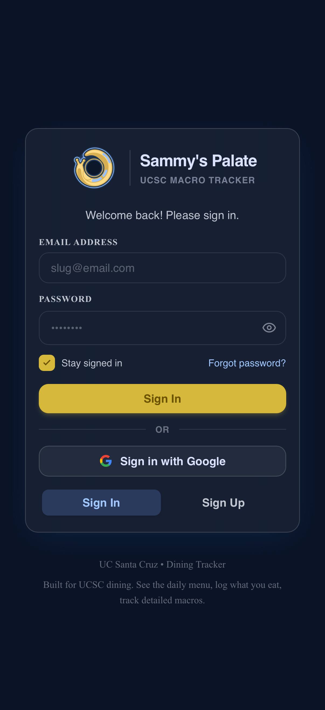
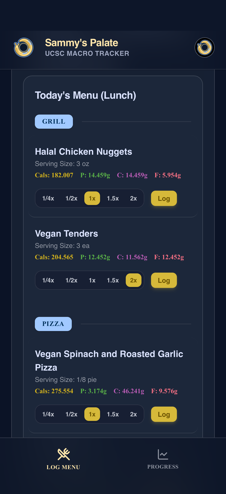
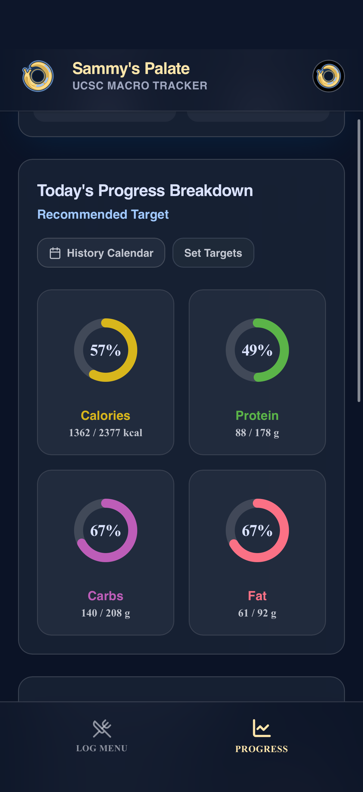
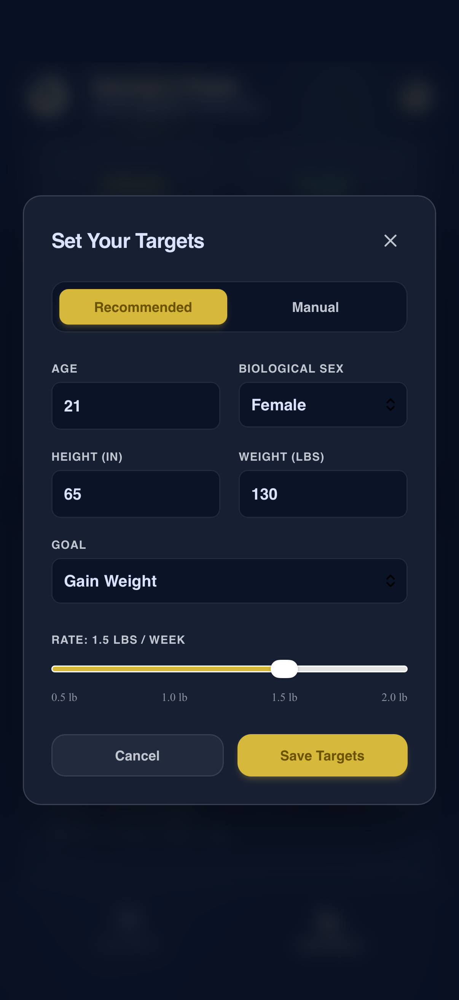
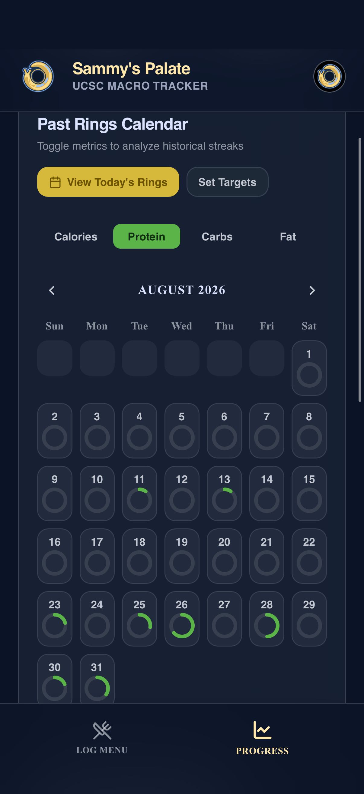
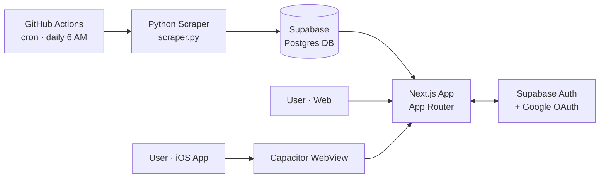

# Sammy's Palate — UCSC Macro Tracker

A macro and nutrition tracker built specifically for UC Santa Cruz dining halls — browse today's menu, log what you eat in a couple of taps, and watch your calories/protein/carbs/fat update in real time.

[](https://ucsc-dining-tracker.vercel.app)


**[🔗 Live Demo](https://ucsc-dining-tracker.vercel.app/)** — sign up and try it out. Also available as a native iOS app (TestFlight, App Store submission in progress).

---

## Table of Contents
- [Why I Built This](#why-i-built-this)
- [Screenshots](#screenshots)
- [Features](#features)
- [Tech Stack](#tech-stack)
- [Architecture](#architecture)
- [Getting Started](#getting-started)
- [Usage](#usage)
- [Roadmap](#roadmap)
- [License](#license)

## Why I Built This

UCSC's official dining hall nutrition calculator technically has the data I need, but using it is a pain: the interface makes it slow to find items, there's no way to search or filter by station, and — most importantly — **it doesn't save anything**. Every day starts from zero, with no history of what you've eaten or how close you are to your goals.

Sammy's Palate solves that. Every morning at 6 AM, a scraper pulls the current menu for every UCSC dining hall and coffee shop. The web app turns that data into a fast, searchable menu you can log meals from in seconds, with your daily macro totals, progress rings, and history saved automatically. It's also shipped as a native iOS app.

## Screenshots

<table>
<tr>
<td align="center" width="50%"><br/><sub>Sign in with email or Google</sub></td>
<td align="center" width="50%"><br/><sub>Browse today's menu by dining hall, meal, and station</sub></td>
</tr>
<tr>
<td align="center" width="50%"><br/><sub>Live macro breakdown against your daily targets</sub></td>
<td align="center" width="50%"><br/><sub>Recommended targets from age, sex, height, weight, and goal — or set your own manually</sub></td>
</tr>
<tr>
<td align="center" colspan="2"><br/><sub>Past days at a glance, ring completion by metric</sub></td>
</tr>
</table>

## Features

**Menu browsing**
- Live menu pulled daily for every UCSC dining hall and coffee shop
- Filter by meal period (Breakfast/Lunch/Dinner/Late Night) and by station (Entrees, Grill, Hot Bars, Soups, Cereal, Condiments, and more)
- Free-text search across today's items
- Instant open/closed status per dining hall, computed from published hours — no scraping delay

**Logging & tracking**
- One-tap logging with adjustable serving size (¼x–2x)
- Real-time totals for calories, protein, carbs, and fat, color-coded to match progress rings
- Delete or adjust anything logged that day

**Progress & goals**
- Recommended daily targets calculated from age, biological sex, height, weight, and goal (lose/maintain/gain), or set targets manually
- Ring-based progress view for each macro, updated live as you log
- History calendar to review past days by any metric
- Guided onboarding after signup to set initial targets

**Account & Auth**
- Email/password sign-up, with a forgot-password flow
- Google Sign-In
- "Stay signed in" toggle
- Editable profile: nickname, avatar (with camera/photo library upload)
- Account deletion

**Native iOS App**
- Built with Capacitor, CI/CD via Codemagic
- Deep-link handling for OAuth and password reset
- On TestFlight, App Store submission in progress

## Tech Stack

| Layer | Technology |
|---|---|
| Frontend | Next.js (App Router), TypeScript |
| Auth & Database | Supabase (Postgres + Auth, Google OAuth) |
| Scraper | Python — Playwright (dynamic page rendering), BeautifulSoup (HTML parsing), python-dotenv, supabase-py |
| Automation | GitHub Actions (scheduled cron: daily menu scrape + frequent hall status updates) |
| Native App | Capacitor (iOS), Codemagic (CI/CD) |
| Hosting | Vercel |
| Linting | ESLint |

## Architecture



Every morning, a scheduled GitHub Action runs `scraper.py`, which pulls the day's menu for each dining hall and writes it to Supabase. A second, more frequent workflow keeps hall open/closed status current. The Next.js app reads menu data from Supabase at request time and handles auth, food logging, and progress tracking through the same database. The iOS app is a Capacitor-wrapped shell that loads the same live web app.

## Getting Started

### Prerequisites
- Node.js 18+
- Python 3.10+
- A Supabase project (free tier is fine)

### 1. Clone the repo
```bash
git clone https://github.com/kunjalp/ucsc_dining_tracker.git
cd ucsc_dining_tracker
```

### 2. Set up the web app
```bash
cd web-app
npm install
```

Create a `.env.local` file in `web-app/` with:
```bash
NEXT_PUBLIC_SUPABASE_URL=your-supabase-project-url
NEXT_PUBLIC_SUPABASE_ANON_KEY=your-supabase-anon-key
```

Run the dev server:
```bash
npm run dev
```
The app will be available at `http://localhost:3000`.

### 3. Set up the scraper
```bash
cd ../scraper
pip install -r requirements.txt
playwright install chromium
python scraper.py
```
The scraper writes directly to your Supabase database, so make sure your Supabase credentials are configured for it as well (see `.github/workflows/` for how this runs in production).

## Usage

1. Sign up or sign in with email or Google.
2. On **Log Menu**, pick a dining hall and meal period, then search or filter by station to find what you're eating.
3. Adjust the serving size multiplier and tap **Log**.
4. Switch to **Progress** to see live totals against your daily targets, or open **History Calendar** to review past days.
5. Set or update your daily targets anytime from **Set Targets**.

## Roadmap

- [ ] Automated backend unit tests for the scraper's parsing logic
- [ ] Macro optimization engine — suggest meal combos that hit a target
- [ ] Meal history export
- [ ] Push/email reminders to log meals

## License

This project is licensed under the [MIT License](LICENSE).

---

Built by [Kunjal Purohit](https://github.com/kunjalp) — UCSC's official nutrition calculator is a pain to use, so I built my own.